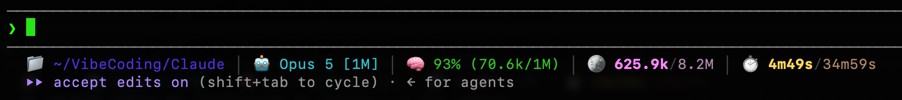

# statusline-rich

一个信息丰富、带图标和颜色的 **Claude Code 状态栏（statusLine）**，一行展示：当前目录、模型（含上下文窗口大小）、上下文剩余、Token 吞吐（本会话 / 当天）、API 耗时（本会话 / 当天）。



```
📁 ~/proj │ 🤖 Opus 5 [1M] │ 🧠 87% (130.5k/1M) │ 🪙 573.9k/2.1M │ ⏱️ 3m12s/1h05m
```

## 展示的内容

| 段 | 图标 | 含义 |
|----|------|------|
| 目录 | 📁 | 当前工作目录（`$HOME` 显示为 `~`） |
| 模型 | 🤖 | 模型名 + 上下文窗口大小（`[1M]` / `[200k]`），自动去掉模型名里自带的 `(… context)` |
| 上下文 | 🧠 | 剩余百分比 +（已用 / 总量）。剩余 >50% 绿色，20%–50% 黄色，<20% 红色 |
| Token | 🪙 | **本会话 / 当天所有会话**的全量吞吐：input + output + cache 读 + cache 写，从 transcript 增量累加，按消息 id 去重，包含子代理，不受上下文压缩影响 |
| 耗时 | ⏱️ | **本会话 / 当天所有会话**真正等 API 响应的时长（不含阅读、思考、打字时间） |

本会话的数值用亮色加粗，当天的数值用同色系柔和色。

## 依赖

- Python 3.7+（macOS / 大多数 Linux 自带）。不需要 `jq`，不联网。

## 安装

### 方式 A：作为 skill（推荐）

```bash
git clone https://github.com/Jin-Ex0076/statusline-rich.git ~/.claude/skills/statusline-rich
```

然后在 Claude Code 里输入 `/statusline-rich`（或者说「装一下 statusline-rich 状态栏」），它会运行安装器并汇报结果。

### 方式 B：手动安装

```bash
python3 install.py
```

安装器会：

1. 把 `statusline.py` 复制为 `~/.claude/statusline-rich.py`；
2. 备份 `~/.claude/settings.json`（`settings.json.bak-<时间>`）；
3. 只写入 `statusLine` 字段，其余配置原样保留；若原来有别的 `statusLine`，会打印出来方便找回。

可重复执行，下次与 Claude Code 交互时即生效，无需重启。

### 卸载

```bash
python3 ~/.claude/skills/statusline-rich/install.py --uninstall
```

## 更新

```bash
git -C ~/.claude/skills/statusline-rich pull
```

然后再跑一次 `/statusline-rich`（安装器会把新脚本复制到位）。

## 常见问题

- **用 cc-switch 切换供应商后状态栏消失了？** cc-switch 这类工具会整个重写 `settings.json`，把 `statusLine` 冲掉。再运行一次 `/statusline-rich` 即可恢复。
- **「当天」的数字为什么比实际少？** 当天统计从安装后开始累计；已经关掉的会话不会被计入。
- **统计数据存在哪？** `~/.claude/statusline-data/`，自动保留 7 天。

## 自定义

改 `~/.claude/statusline-rich.py`（想随仓库分享就同时改仓库里的 `statusline.py`）：

- **换颜色**：修改顶部 `TOK_SESS` / `TOK_DAY` / `API_SESS` / `API_DAY` 等常量（256 色编号）
- **删掉某段**：在 `main()` 末尾的 `parts` 列表里去掉对应项
- **只显示目录名**：把 `cwd` 改成 `os.path.basename(cwd)`

## License

MIT
